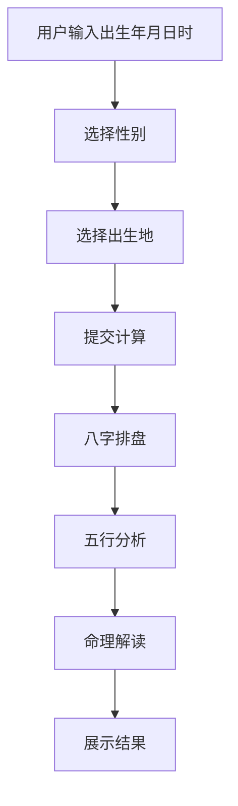

# 问真八字算命网页 - 产品需求文档

## 1. 产品概述

基于中国传统八字命理学的在线算命网页，用户输入出生年月日时信息，即可获得详细的命理分析。

- **核心目的**：为用户提供便捷的八字排盘与命理分析服务
- **目标用户**：对中国传统命理学感兴趣的用户
- **产品价值**：融合传统文化与现代设计，提供专业且美观的命理体验

---

## 2. 核心功能

### 2.1 用户角色

| 角色 | 使用方式 | 核心权限 |
|------|----------|----------|
| 普通用户 | 直接访问 | 输入出生信息，获取八字分析 |

### 2.2 功能模块

1. **首页**：八字输入表单 + 命理结果显示
2. **八字排盘模块**：年月日时四柱显示、天干地支藏干
3. **五行分析模块**：五行分数统计、五行占比图
4. **命理解读模块**：日主分析、大运流年建议

### 2.3 页面详情

| 页面名称 | 模块名称 | 功能描述 |
|----------|----------|----------|
| 首页 | 八字输入表单 | 选择出生年月日时、性别，选择或输入出生地 |
| 首页 | 八字排盘展示 | 显示年柱、月柱、日柱、时柱，含天干地支藏干 |
| 首页 | 五行分析 | 显示五行分数、占比图表、日主强弱判断 |
| 首页 | 命理解读 | 十神分析、性格特点、事业财运建议 |

---

## 3. 核心流程

用户输入出生信息 → 系统排盘计算 → 显示八字四柱 → 分析五行 → 解读命理

---

## 4. 用户界面设计

### 4.1 设计风格

- **主题**：古典东方美学，融合传统水墨与现代简约
- **主色调**：深墨色 #1a1a2e、暖金色 #c9a959、米白色 #f5f0e6
- **辅助色**：朱砂红 #a63d40、翠绿 #4a7c59
- **按钮风格**：圆角矩形，带有微妙阴影和金色边框
- **字体**：思源宋体（标题）+ 思源黑体（正文）
- **布局**：单页应用，卡片式布局，居中对称

### 4.2 页面设计概述

| 页面名称 | 模块名称 | UI元素 |
|----------|----------|--------|
| 首页 | 顶部导航 | Logo + 标题"问真八字" |
| 首页 | 输入表单区 | 4个下拉选择器 + 性别选择 + 提交按钮 |
| 首页 | 八字展示区 | 四柱卡片，每柱显示天干地支 |
| 首页 | 五行分析区 | 雷达图/柱状图展示五行占比 |
| 首页 | 命理解读区 | 文字描述区，含日主强弱、十神、性格、事业建议 |

### 4.3 响应式设计

- 桌面端优先设计
- 平板/手机端自适应布局，保持核心功能完整

---

## 5. 八字计算逻辑

### 5.1 输入项

- 出生年份（公历）
- 出生月份（公历）
- 出生日期（公历）
- 出生时辰（子时23:00-01:00丑时01:00-03:00...）
- 性别（男/女）
- 出生地区（用于真太阳时计算，可选）

### 5.2 输出项

1. **四柱信息**：年柱、月柱、日柱、时柱（天干+地支）
2. **藏干信息**：每个地支藏的人元
3. **五行分数**：木、火、土、金、水各行分数
4. **日主强弱**：日干得令程度评分
5. **十神对应**：根据日干与其他天干地支关系判定

### 5.3 计算规则

- 使用天文算法计算节气时间，确定月柱
- 日干支按公历日期查表或推算
- 时干支根据出生时辰推算
- 五行分数根据天干地支的五行属性累计

---

## 6. 文案内容规范

### 6.1 八字展示文案

- 四柱格式："甲子年 乙丑月 丙寅日 丁卯时"
- 藏干格式：地支后标注藏干，如"子藏癸"

### 6.2 命理解读文案

- 日主分析：描述日干特性，如"丙火日主，性格热情积极..."
- 五行建议：根据五行缺失提供调理建议
- 事业财运：根据八字组合提供方向性建议
- 内容需科学合理，避免过于绝对的表述
