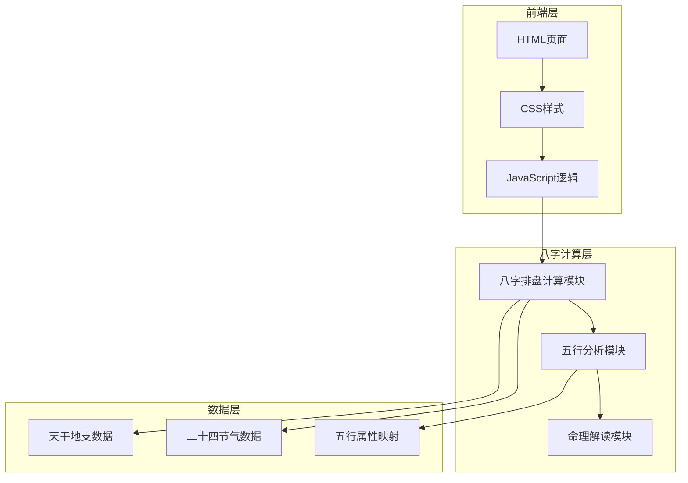

# 问真八字算命网页 - 技术架构文档

## 1. 架构设计



## 2. 技术选型

- **前端**：纯HTML5 + CSS3 + JavaScript（原生实现，无框架依赖）
- **样式**：自定义CSS，使用CSS变量管理主题色
- **图表**：Canvas绘制五行占比图
- **字体**：Google Fonts - 思源宋体 + 思源黑体
- **无后端**：所有计算均在浏览器端完成

## 3. 路由定义

| 路由 | 用途 |
|------|------|
| /index.html | 单页应用首页，包含输入表单和结果展示 |

## 4. 八字计算数据结构

### 4.1 天干地支定义

```javascript
// 天干
const TIANGAN = ['甲', '乙', '丙', '丁', '戊', '己', '庚', '辛', '壬', '癸'];

// 地支
const DIZHI = ['子', '丑', '寅', '卯', '辰', '巳', '午', '未', '申', '酉', '戌', '亥'];

// 地支藏干
const ZANGAN = {
    '子': ['癸'],
    '丑': ['己', '癸', '辛'],
    '寅': ['甲', '丙', '戊'],
    '卯': ['乙'],
    '辰': ['戊', '乙', '癸'],
    '巳': ['丙', '庚', '戊'],
    '午': ['丁', '己'],
    '未': ['己', '丁', '乙'],
    '申': ['庚', '壬', '戊'],
    '酉': ['辛'],
    '戌': ['戊', '辛', '丁'],
    '亥': ['壬', '甲']
};

// 五行属性
const WUXING = {
    '甲': '木', '乙': '木',
    '丙': '火', '丁': '火',
    '戊': '土', '己': '土',
    '庚': '金', '辛': '金',
    '壬': '水', '癸': '水',
    '子': '水', '丑': '土', '寅': '木', '卯': '木',
    '辰': '土', '巳': '火', '午': '火', '未': '土',
    '申': '金', '酉': '金', '戌': '土', '亥': '水'
};
```

### 4.2 节气数据（简化版）

```javascript
// 二十四节气交节日期（每月两个节气）
const JIEQI = {
    '小寒': '01-05', '大寒': '01-20',
    '立春': '02-04', '雨水': '02-19',
    '惊蛰': '03-05', '春分': '03-20',
    '清明': '04-04', '谷雨': '04-20',
    '立夏': '05-05', '小满': '05-21',
    '芒种': '06-05', '夏至': '06-21',
    '小暑': '07-07', '大暑': '07-22',
    '立秋': '08-07', '处暑': '08-23',
    '白露': '09-07', '秋分': '09-23',
    '寒露': '10-08', '霜降': '10-23',
    '立冬': '11-07', '小雪': '11-22',
    '大雪': '12-07', '冬至': '12-21'
};
```

### 4.3 输入输出接口

**输入参数**：
```javascript
{
    year: number,      // 出生年份 1990
    month: number,     // 出生月份 1-12
    day: number,       // 出生日期 1-31
    hour: number,      // 出生时辰 0-23
    gender: string     // '男' | '女'
}
```

**输出结果**：
```javascript
{
    nianzhu: string,   // 年柱 如"甲子"
    yuezhu: string,    // 月柱 如"乙丑"
    rizhu: string,     // 日柱 如"丙寅"
    shizhu: string,    // 时柱 如"丁卯"
    ganzhi: {
        nian: { tian: string, zhi: string, canggan: string[] },
        yue: { tian: string, zhi: string, canggan: string[] },
        ri: { tian: string, zhi: string, canggan: string[] },
        shi: { tian: string, zhi: string, canggan: string[] }
    },
    wuxing: {
        mu: number,    // 木分数
        huo: number,    // 火分数
        tu: number,     // 土分数
        jin: number,    // 金分数
        shui: number    // 水分数
    },
    rizhuQiangruo: string,  // 日主强弱 如"身弱"
    wuxingPingheng: string, // 五行分析 如"木旺水弱"
    jieguo: {
        rizhufengxi: string,   // 日主分析
        shishen: string,       // 十神分析
        xingge: string,        // 性格特点
        yunshi: string         // 运势建议
    }
}
```

## 5. 文件结构

```
d:\算命\1\
├── index.html          # 主页面
├── styles.css          # 样式文件
├── app.js              # 主要逻辑
└── .trae\documents\    # 文档目录
    ├── PRD.md          # 产品需求文档
    └── README.md       # 技术架构文档
```

## 6. 命理解读内容生成规则

### 6.1 日主分析
根据日干五行属性，结合月令（出生月份地支）判断日主强弱

### 6.2 十神判定
根据其他三柱天干与日干的关系（五行相生相克）判定十神：
- 比肩、劫财、食神、伤官、正财、偏财、正官、七杀、正印、偏印

### 6.3 性格分析
根据日干特性 + 五行分布 + 十神组合生成性格描述

### 6.4 运势建议
根据五行缺失和日主强弱提供事业、财运、感情、健康方面的方向性建议
